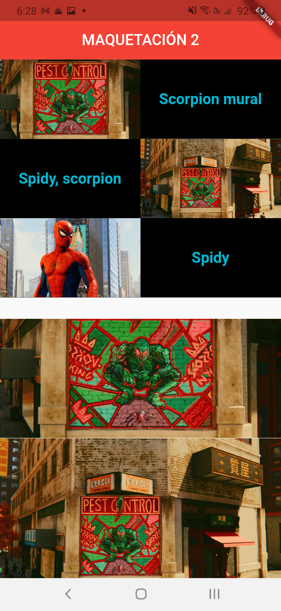
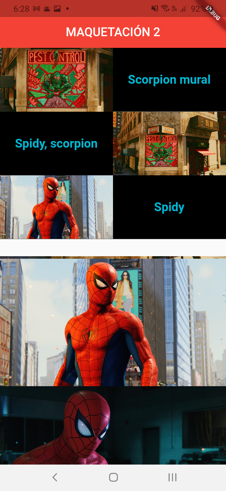
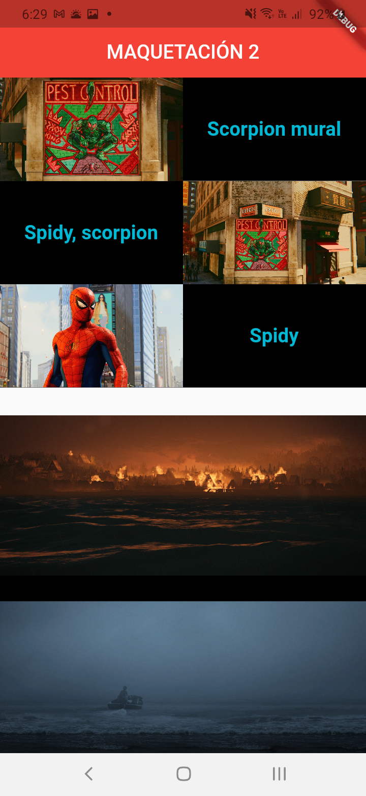
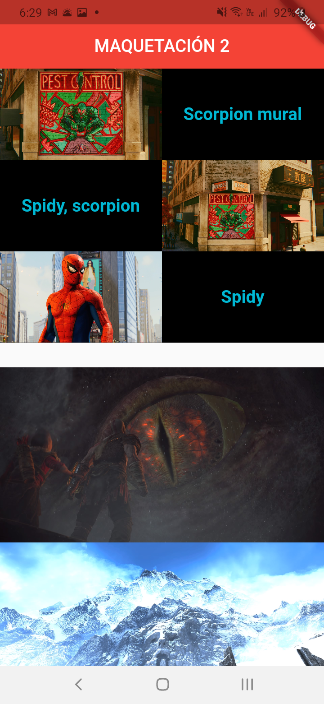
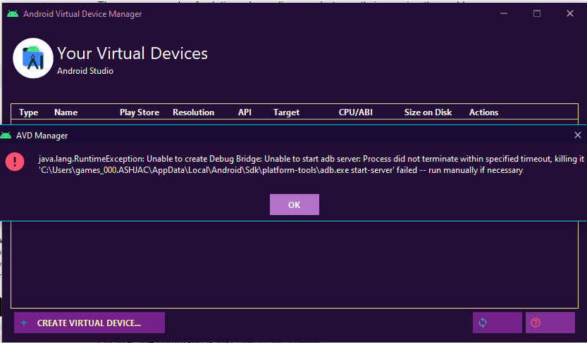
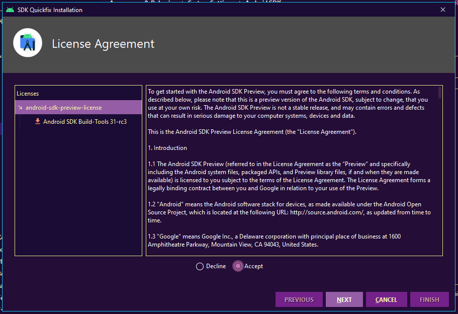
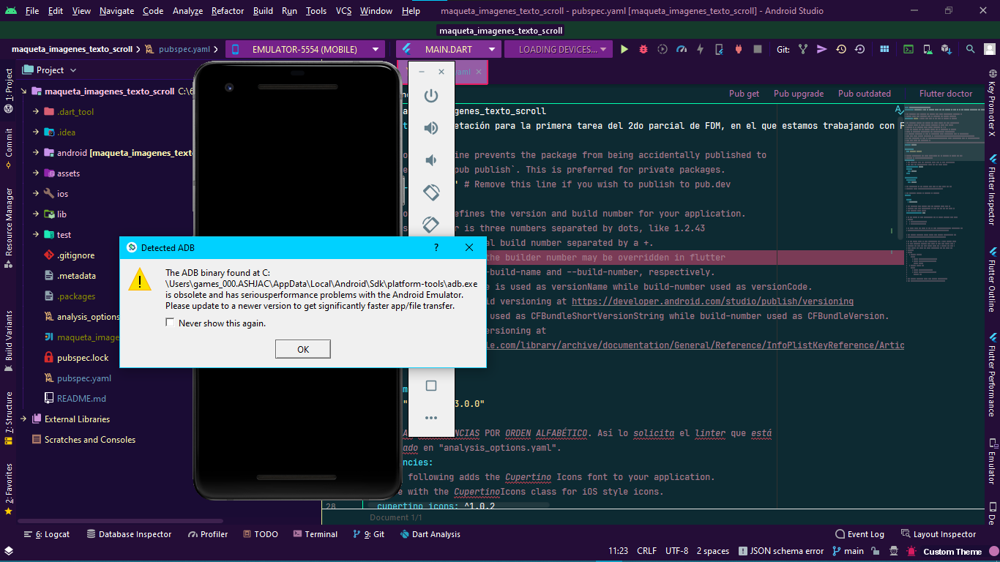

# 1. [T2.2] MAQUETA CON APPBAR, IMÁGENES, TEXTO Y SCROLL

Maquetación para la segunda tarea del 2do parcial de FDM, en el que estamos
trabajando con Flutter. Hay que hacer la maquetación que nos dijo el profesor,
la cual deberá contener: Imágenes, texto y un scroll con diversos elementos.

- [1.1. ***FECHA DE ENCARGO***](#11-fecha-de-encargo)
- [1.2. VARIABLES DE USUARIO](#12-variables-de-usuario)
- [1.3. **PROBLEMAS CON EL EMULADOR DE ANDROID**](#13-problemas-con-el-emulador-de-android)
  - [1.3.1. ***UNABLE TO START `adb server`***](#131-unable-to-start-adb-server)
    - [1.3.1.1. **SOLUCIÓN DE STACK OVERFLOW <- FUNCIONÓ CORRECTAMENTE*](#1311-solución-de-stack-overflow---funcionó-correctamente)
      - [1.3.1.1.1. **FINALMENTE, DESPUÉS DE MUCHOS DÍAS E INTENTOS FALLIDOS, CORRIÓ EL EMULADOR**](#13111-finalmente-después-de-muchos-días-e-intentos-fallidos-corrió-el-emulador)
  - [1.3.2. ***PROBLEMA CON `adb.exe`***](#132-problema-con-adbexe)
    - [1.3.2.1. **PASOS PARA LA SOLUCIÓN DEL PROBLEMA (DE STACK OVEFLOW)**](#1321-pasos-para-la-solución-del-problema-de-stack-oveflow)
- [1.4. **LINTER**](#14-linter)
  - [1.4.1. **CÓMO HACERLO FUNCIONAR**](#141-cómo-hacerlo-funcionar)
  - [1.4.2. **ENLACES**](#142-enlaces)
- [1.5. FUENTES DE APOYO VARIAS](#15-fuentes-de-apoyo-varias)
- [1.6. *Getting Started <- Venía por default al crear el proyecto*](#16-getting-started---venía-por-default-al-crear-el-proyecto)

## 1.1. ***FECHA DE ENCARGO***

> Martes, 27 ABRIL 2021

## 1.2. **RESULTADO FINAL**






Tuve problemas con la parte de esa separación que se ve entre los dos elementos
en la pantalla. Creo que eso pasa por utilizar el Flexible en el Column, pero no
estoy seguro.

También quería que se viera un texto debajo de cada una de las imágenes, pero no
lo logré porque no pude mostrar los elementos como Column dentro del
`ListView.builder`, ya que solo se veía blanca la pantalla.

### 1.2.1. ***CÓMO TOMÉ LAS SCREENSHOT***

Los pasos los obtuve desde unos ***issues de GitHub***:

- [Genymobile/scrcpy | Screenshot/Record Screen #21](https://github.com/Genymobile/scrcpy/issues/21 "Genymobile/scrcpy | Screenshot/Record Screen #21")
- [Genymobile/scrcpy | Support screen recording #116](https://github.com/Genymobile/scrcpy/issues/116 "Genymobile/scrcpy | Support screen recording #116")

Las screenshot las tomé abriendo el programa `scrcpy`, yendo a la carpeta en
donde quiero guardar las screenshot y , ejecutando el siguiente comando:

> ```properties
> cd carpeta-screenshots
> adb exec-out screencap -p > nombre.png
> ```

## 1.3. CÓMO TOMAR VIDEO

El video que tomé salió corrupto, pero se supone que es con el siguiente comando
dentro de la carpeta en donde lo quieres:

> ```properties
> scrcpy --record file.mp4
> ```

## 1.4. **VARIABLES DE USUARIO**

- ### ***ANDROID_HOME***

  Había establecido esta variable de usuario, pero según la [documentación
  oficial de Android Studio], esta variable ya no está disponible:

  > "*ANDROID_HOME, que también dirige al directorio de instalación del SDK,
  > dejó de estar disponible*".

- ### **VARIABLES QUE SÍ PUEDO ESTABLECER**

  Según la [documentación oficial de Android Studio], puedo establecer las
  siguientes variables del sistema:

  - ANDROID_SDK_ROOT=C:\Users\\...\AppData\Local\Android\Sdk

  Hay varias, pero esa es la que establecí por el momento.

[documentación oficial de Android Studio]: <https://developer.android.com/studio/command-line/variables?hl=es-419> "developers.android.com | Variables del entorno"

## 1.5. ME TARDABA MUCHO EN INICIAR LA APP EN EL CELULAR

Ejecuté los siguientes comandos y volví a construir la App y ya funcionó:

- `./gradlew clean build`:
  
  1. Desde la carpeta del proyecto accede a `android`:

    > cd android

  2. Ejecutar el siguiente comando:

    > ```properties
    > ./gradlew clean build
    >```
    >
    > **`NOTA`**: Este proceso puede tardar mucho. En mi caso tardó 39 minutos en
    > llegar al 100%.

- Aceptar licencias de Android:

  1. Ejecuta el siguiente comando:

    > ```properties
    > flutter doctor --android-licenses
    > ```

## 1.6. **PROBLEMAS CON EL EMULADOR DE ANDROID**

### 1.6.1. ***UNABLE TO START `adb server`***

Me encontré con el siguiente problema:

> java.lang.RuntimeException: Unable to create Debug Bridge: Unable to start adb
> server: Process did not terminate within specified timeout, killing it
> 'C:\Users\games_000.ASHJAC\AppData\Local\Android\Sdk\platform-tools\adb.exe start-server'
> failed -- run manually if necessary



#### 1.6.1.1. **SOLUCIÓN DE STACK OVERFLOW <- FUNCIONÓ CORRECTAMENTE*

[Respuesta de "`Letsintegreat`": Error initializing ADB: Unable to create Debug Bridge: Unable to start ADB server | Stack Overflow](https://stackoverflow.com/a/49345049/13562806 "Error initializing ADB: Unable to create Debug Bridge: Unable to start ADB server | Stack Overflow")

1. Cierra Android Studio
2. Abre una terminal
3. Navega al directorio de `platform-tools`.

    1. En la mayoría de las ocasiones se encuentra en el siguiente directorio:

        > C:\Users\[user]\AppData\Local\Android\android-sdk\platform-tools

    2. En mi computadora se encuentra en el siguiente directorio:

        > C:\Users\games_000.ASHJAC\AppData\Local\Android\Sdk\platform-tools

4. Escribe el siguiente comando y presiona enter.

    > ```properties
    > adb.exe start-server
    > ```

    

    

5. **Vuelve a abrir *Android Studio*.**

##### 1.6.1.1.1. **FINALMENTE, DESPUÉS DE MUCHOS DÍAS E INTENTOS FALLIDOS, CORRIÓ EL EMULADOR**

")
")

### 1.6.2. ***PROBLEMA CON `adb.exe`***

Me salió un mensaje cuando quise iniciar el emulador. Ya van varias veces que
intento iniciarlo, pero me dice que no encuentra el `adb.exe` y que no se puede
ejecutar, por lo que intento ejecutarlo de nuevo, y me dice que ya hay una
instancia ejecutándolo.

Después, me salió una imagen con un error:



#### 1.6.2.1. **PASOS PARA LA SOLUCIÓN DEL PROBLEMA (DE STACK OVEFLOW)**

> > Encontré una solución en Stack Overflow, pero aún no sé si funcione. La tendré
> > que probar. Por ahora, este es el enlace de dicha solución:
> >
> > - [ADB.exe is obsolete and has serious performance problems | Stack Overflow](https://stackoverflow.com/questions/51240223/adb-exe-is-obsolete-and-has-serious-performance-problems "ADB.exe is obsolete and has serious performance problems")
> >
> > La solución que por lo que veo me podría funcionar es la de: ***Kuya***
>
> Estos pasos se realizan desde Android Studio con el editor abierto, pero se
> puede hacer desde la pantalla inicial. Solo hay que abrir el "***`SDK Manager`***"
> en primera instancia, pero aquí se indica cómo abrirlo desde el editor como tal.
>
> 1. Presiona **dos veces shift para abrir el buscador de Android Studio**.
> 2. Escribe: "***`SDK Manager`***"
> 3. En los resultados que aparezcan da click en "***`SDK Manager`***".
> 4. En la ventana que aparece da click en la segunda pestaña: "***`SDK Tools`***".
>    - En esta pestaña verás que hay una actualización disponible para los "***`SDK Build-Tools`***" en la primera línea.
> 5. Palomea (check) el campo "***`Show Package Details`***" en la esquina inferior derecha.
> 6. Desplázate hasta el último item con el nombre de "***`SDK Build-Tools`***" y palomea el campo.
> 7. Da click en "**`Apply`**".
> 8. En el cuadro de diálogo que se te muestre, da click en "**`OK`**".
> 9. Cuando el instalador termine, da click en "**`Finish`**".
> 10. Uncheck (quita el palomeado) el campo de "***`Show Package Details`***" y revisa que en el campo "***`Android SDK Build-Tools`***" (primera línea) indique que no hay una actualización disponible, es decir, que diga "**`Installed`**".
> 11. Da click en "**`OK`**" para cerrar el "***`SDK Manager`***".

## 1.7. **LINTER**

Yo utilicé el siguiente linter:

> [Lint for Dart/Flutter <- El Linter que yo utilicé]
>
> "`lint` is a hand-picked, open-source, community-driven collection of lint
> rules for Dart and Flutter projects. The set of rules follows the [Effective
> Dart: Style Guide](https://dart.dev/guides/language/effective-dart/style
> "[Documentación] Effective Dart: Style").
>
> This package can be used as a replacement for
> [`package:pedantic`](https://github.com/google/pedantic
> "https://github.com/google/pedantic") for those who prefer stricter rules".

### 1.7.1. **CÓMO HACERLO FUNCIONAR**

1. Hay que **agregarlo a 2 archivos** en primera instancia:

    1. [*pubspec.yaml*](pubspec.yaml "The pusbspec file")

        > <cite>
        > "Every pub package needs some metadata so it can specify its
        > dependencies. Pubpackages that are shared with others also need to
        > provide some otherinformation so users can discover them. All of this
        > metadata goes in thepackage’s pubspec: a file named pubspec.yaml
        > that’s written in the YAML language".
        > </cite>
        >
        > En este archivo se encuentran definidas las dependencias, las
        > dependencias de desarrollador, los assets, y otras cosas. Por esta
        > razón, hay que agregarlo a las dependencias (`dependencies`) con el
        > nombre de `lint` de la siguiente forma:
        >
        > ```yaml
        > dependencies:
        >   foo:
        >     foo:
        >   lint:
        > ```

    2. [*analysis_options.yaml*](analysis_options.yaml "Archivo para establecer las reglas del linter")

        > Este archivo no se agrega de forma automática al inicializar un
        > proyecto de `Flutter`, por lo que hay que agregarlo manualmente.
        > Ya habiendo creado el archivo, hay que agregar la siguiente línea en
        > la parte superior del archivo:
        >
        > ```yaml
        > include: package:lint/analysis_options.yaml
        > ```
        >
        > Lo que hace es agregar las reglas establecidas en el linter
        > descargado.
        >
        > #### **Cambiar reglas de forma personalizada**
        >
        > > En el archivo podemos modificar las reglas que queramos de la
        > > siguiente forma como se indica en el enlace
        > > [Lint for Dart/Flutter: Enable/Disable rules](https://pub.dev/packages/lint#enabledisable-rules
        > > "Lint for Dart/Flutter: Enable/Disable rules"):
        > >
        > > ```yaml
        > > include: package:lint/analysis_options.yaml
        > > 
        > > linter:
        > >   rules:
        > >     # ------ Disable individual rules ----- #
        > >     #                 ---                   #
        > >     # Turn off what you don't like.         #
        > >     # ------------------------------------- #
        > > 
        > >     # Use parameter order as in json response
        > >     always_put_required_named_parameters_first: false
        > >     
        > >     # Util classes are awesome!
        > >     avoid_classes_with_only_static_members: false
        > > 
        > > 
        > >     # ------ Enable individual rules ------ #
        > >     #                 ---                   #
        > >     # These rules here are good but too     #
        > >     # opinionated to enable them by default #
        > >     # ------------------------------------- #
        > > 
        > >     # Make constructors the first thing in every class
        > >     sort_constructors_first: true
        > > 
        > >     # The new tabs vs. spaces. Choose wisely
        > >     prefer_single_quotes: true
        > >     prefer_double_quotes: true
        > > 
        > >     # Good packages document everything
        > >     public_member_api_docs: true
        > >     
        > >     # Blindly follow the Flutter code style, which prefers types everywhere
        > >     always_specify_types: true
        > > 
        > >     # Back to the 80s
        > >     lines_longer_than_80_chars: true
        > > ```

2. Finalmente, hay que seguir los siguientes pasos para poder obtener los
   paquetes que hemos especificado y hacer funcionar al linter.
    <!-- https://stackoverflow.com/questions/20303826/highlight-bash-shell-code-in-markdown-files -->

    - **En Visual Studio Code**:

      - Colócate en el archivo [pubspec.yaml](pubspec.yaml). Hay dos opciones
        para hacer funcionar al linter.

          1. Presiona `F1` o `Ctrl + Shift + P`. Se abrirá una barra en la parte
             superior de la pantalla en donde podrás escribir instrucciones.

             - Escribe el siguiente comando:

                ```properties
                Pub: Get Packages
                ```

          2. Guarda el archivo de la forma que tu prefieras. En mi caso
             simplemente  presiono `Ctrl + S`. Visual Studio Code ejecutará el
             mismo comando de la opción 1.

        > **NOTA:** Con cualquiera de las 2 opciones que lo hagas, se ejecutará
        > el mismo comando:
        >
        > ```properties
        > flutter pub get
        > ```

    - **En la terminal:**

      - Escribe el siguiente comando para obtener los paquetes:

        ```properties
        flutter pub get
        ```

      - Escribe el siguiente comando para hacer funcionar el linter y que te
        muestre los errores en la terminal. Esto no te mostrará los
        errores/warnings en el editor de texto.

        ```properties
        dart analyze
        ```

    Después de ejecutar estos comandos, si todo sale bien, el paquete estará
    activo y mostrará los errores o warnings que tenga tu programa dependiendo
    de las reglas que hayas establecido. Si no modificaste las reglas, entonces
    te mostrará los errores dependiendo de las reglas del paquete base.

### 1.7.2. **ENLACES**

> - [Lint for Dart/Flutter <- El Linter que yo utilicé]
> - [Linter for Dart: Supported Lint Rules](https://dart-lang.github.io/linter/lints/index.html "Supported Dart Lint Rules")
> - [Analysis Options - Opciones posibles para el linter](https://dart-lang.github.io/linter/lints/options/options.html "Todas las opciones posibles para el linter base")

[Lint for Dart/Flutter <- El Linter que yo utilicé]: <https://pub.dev/packages/lint> "El Linter que yo utilicé"

## 1.8. FUENTES DE APOYO VARIAS

- [VIDEO YouTube | Init | "Curso de Flutter Desde Cero App Clon de Netflix" | 19 jun. 2020](https://www.youtube.com/watch?v=vX_iJVLKU6w&t=3885s&ab_channel=Init "VIDEO YouTube | Init | \"Curso de Flutter Desde Cero App Clon de Netflix\"")
- [VIDEO YouTube | Johannes Milke | "Flutter Tutorial - Safe Area VS AppBar - Android & iOS" | 31 mar. 2021](https://www.youtube.com/watch?v=4O16fHaJc7E&list=PLg8w9DGA17RsDtJYQY2MRvl8mqIn7IWIq&index=3&ab_channel=JohannesMilke "VIDEO YouTube | Johannes Milke | \"Flutter Tutorial - Safe Area VS AppBar - Android & iOS\"")
- [VIDEO YouTube | EXPLICACIÓN  BuildContext context | Coding with Glove | Understanding BuildContext in Flutter | 10 ene. 2020](https://www.youtube.com/watch?v=MFNe7hdOCVs&list=PLg8w9DGA17RsDtJYQY2MRvl8mqIn7IWIq&index=6&ab_channel=CodingwithGlove "VIDEO YouTube | EXPLICACIÓN  BuildContext context")

## 1.9. *Getting Started <- Venía por default al crear el proyecto*

This project is a starting point for a Flutter application.

A few resources to get you started if this is your first Flutter project:

- [Lab: Write your first Flutter app](https://flutter.dev/docs/get-started/codelab)
- [Cookbook: Useful Flutter samples](https://flutter.dev/docs/cookbook)

For help getting started with Flutter, view our
[online documentation](https://flutter.dev/docs), which offers tutorials,
samples, guidance on mobile development, and a full API reference.
